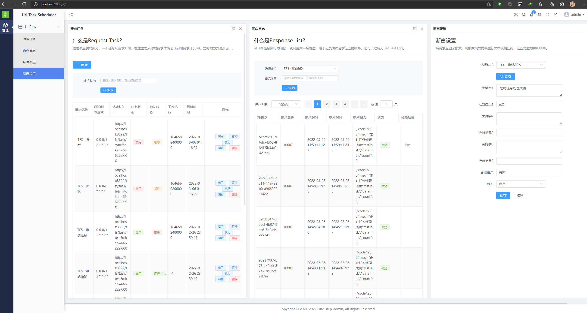
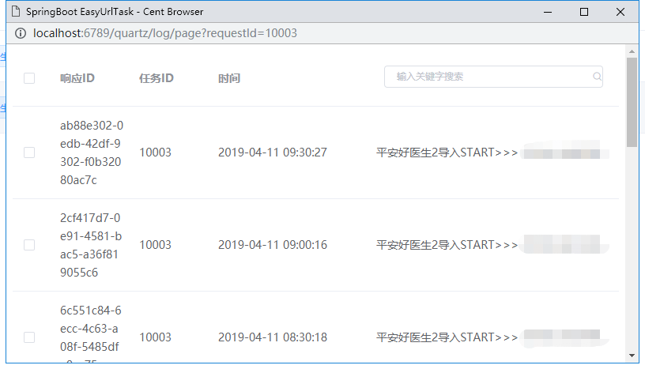
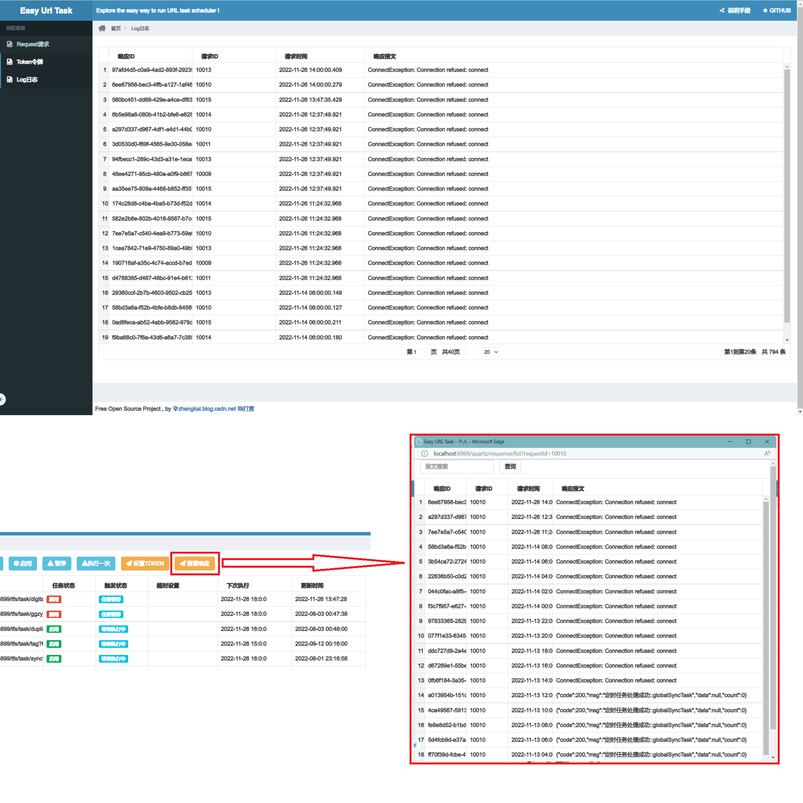

 

EasyUrlTask
----
EasyUrlTask也叫EasyUrlJob、EasyUrlSchedule，基于Quartz 2.3 and SpringBoot2 的URL接口调度平台，支持集群。日常的很多任务调度其实都可以简化为基于URL的调度方式，EasyUrlTask也就因此而生，让URL调度任务更方便。

EasyUrlTask的核心是什么？
----
基于Quartz的二次封装，URL Request是二次封装的核心，包含基本UrlRequest（method、url、cron、name），UrlResponse（响应日志）

UrlRequestPlus
----
by [zhengkai.blog.csdn.net](zhengkai.blog.csdn.net)  
增强版的UrlPlus部分，将会包含TokenAddition（令牌设置Header Token、Form Token、Url Token）、RequestParam（请求参数，FormData或JSON，GET/POST）、ResponseAssert（响应断言，根据返回结果判断是否成功，例如设置keyword="code":"00",state=1，匹配到返回对象包含keyword则代表成功，否则失败）。

TokenAddition
----
- Header Token,pending
- Form Token,done
- Url Token,done

RequestParam
----
- GET URL,done
- POST FROM,done
- POST JSON,done

ResponseAssert
----
- assert,pending

T_TASK_TRIGGERS表 TRIGGER_STATE状态字段
----
- WAITING:等待执行中
- PAUSED:任务暂停
- ACQUIRED:正在执行中
- BLOCKED：任务阻塞 
- ERROR：任务错误

URL
----
- 启动页面 http://localhost:6969/quartz/index
- 测试token页面 http://localhost:6969/quartz/demo/token?username=111&password=222

release log
----
|日期|内容|
|----|----|
|2021-03-28|优化以及修复请求、响应，UI优化，修复执行问题。|
|2021-03-27|重启项目2.0版本，UI改版，UrlRequest优化。|
|2019-04-28|UrlPlus之Url追加Token参数功能，token配置功能，优化gitignore。|
|2019-04-11|优化管理页面，修复一些细节问题，新增日志查看功能,新增travis。|
|2019-04-07|优化核心模块核心状态的封装，包含状态变更简化，管理界面优化|
|2019-04-03|UrlJob里面的Log信息优化|
|2019-03-18|一些简单的页面|
|2019-03-15|分离新旧接口，新封装的再UrlTaskController里面，quartz原生的在JobController里面|