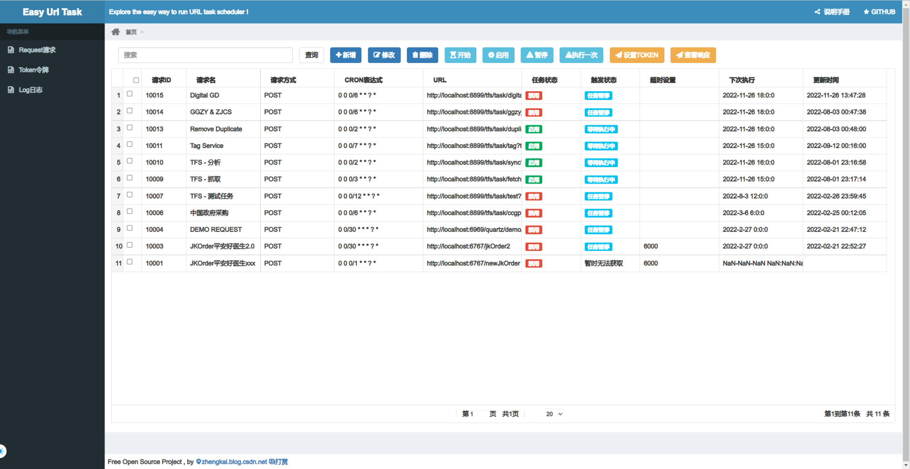

 

spring-boot-UrlTaskScheduler
----
以前叫EasyUrlTask,现在正式改为UrlTaskScheduler,基于BackEnd:Quartz 2.3+SpringBoot2,Frontend:vue one-step-admin 的URL接口调度平台,支持集群.日常的很多任务调度其实都可以简化为基于URL的调度方式,UrlTaskScheduler也就因此而生,让URL调度任务更方便.

Url-Task-Scheduler的核心是什么？
----
URL-PLUS1 : 基于Quartz的二次封装,URL Request是二次封装的核心,包含基本UrlRequest（method、url、cron、name）,UrlResponse（响应日志）

SchedulerPlus
----
by [zhengkai.blog.csdn.net](zhengkai.blog.csdn.net)  
增强版的SchedulerPlus部分,包含:
- TokenAddition（令牌设置Header Token、Form Token、Url Token）
- RequestParam（请求参数,追加FormData或JSON等参数和报文,设置GET/POST属性）
- ResponseAssumption（响应断言,根据返回结果判断是否成功,例如设置keyword="code":"00",state=1,匹配到返回对象包含keyword则代表成功,否则失败）.

TokenAddition
----
- Header Token,pending
- Form Token,done
- Url Token,done

RequestParam
----
- GET URL,done
- POST FROM,done
- POST JSON,done

ResponseAssumption
----
- PENDING

T_TASK_TRIGGERS表 TRIGGER_STATE状态字段
----
- WAITING:等待执行中
- PAUSED:任务暂停
- ACQUIRED:正在执行中
- BLOCKED：任务阻塞 
- ERROR：任务错误

URL
----
- 登录页面(旧) http://localhost:6969/quartz/login (token:85f3389e-d774-4f64-a96c-d4ba61f988b8)
- 启动页面(旧) http://localhost:6969/quartz/index
- 测试token页面 http://localhost:6969/quartz/demo/token?username=111&password=222
- 前端页面(新vue) http://localhost:9000/#/

release log
----
| 日期         | 内容                                                        |
|------------|-----------------------------------------------------------|
| 更新预告       | 优化部分任务处理逻辑和页面展示内容                                         |
| 2022-02-21 | vue跟后台分离,基于one-step-admin实现简单的界面功能,优化token和request.       |
| 2022-02-20 | 基于墨菲安全进行安全扫描,更新相关依赖.                                      |
| 2021-03-28 | 优化以及修复请求、响应,UI优化,修复执行问题.新增登录功能.                           |
| 2021-03-27 | 重启项目2.0版本,UI改版,UrlRequest优化.                              |
| 2019-04-28 | UrlPlus之Url追加Token参数功能,token配置功能,优化gitignore.             |
| 2019-04-11 | 优化管理页面,修复一些细节问题,新增日志查看功能,新增travis.                        |
| 2019-04-07 | 优化核心模块核心状态的封装,包含状态变更简化,管理界面优化                             |
| 2019-04-03 | UrlJob里面的Log信息优化                                          |
| 2019-03-18 | 一些简单的页面                                                   |
| 2019-03-15 | 分离新旧接口,新封装的再UrlTaskController里面,quartz原生的在JobController里面 |