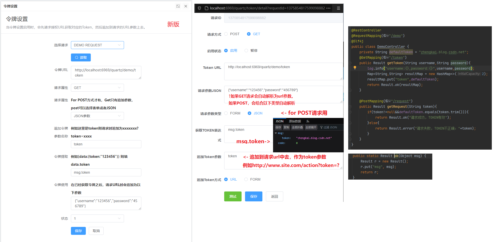

 

EasyUrlTask
----
EasyUrlTask也叫EasyUrlJob、EasyUrlSchedule，基于Quartz 2.3 and SpringBoot2 的URL接口调度平台，支持集群。公司日常的很多任务调度其实都可以简化为基于URL的调度方式，EasyUrlTask也就因此而生，简化日常URL调度任务，并简单管理这些请求。

EasyUrlTask的核心是什么？
----
基于Quartz的二次封装，URL Request是二次封装的核心，包含基本UrlRequest（method、url、cron、name），UrlResponse（响应日志）

UrlRequestPlus
----
未来会有增强的UrlRequestPlus部分，将会包含TokenAddition（Header Token、Form Token、Url Token）、RequestParam（FormData或JSON，GET/POST）、ResponseAssert（响应断言，根据返回结果判断是否成功，例如设置keyword="code":"00",state=1，匹配到返回对象包含keyword则代表成功，否则失败）。

T_TASK_TRIGGERS表 TRIGGER_STATE状态字段
----
- WAITING:等待执行中
- PAUSED:任务暂停
- ACQUIRED:正在执行中
- BLOCKED：任务阻塞 
- ERROR：任务错误

URL_REQUEST_STATUS状态
----
- 0：停止
- 1：运行

release log
----
 - 2019-04-11 优化管理页面，修复一些细节问题，新增日志查看功能,新增travis。
 - 2019-04-07 优化核心模块核心状态的封装，包含状态变更简化，管理界面优化
 - 2019-04-03 UrlJob里面的Log信息优化
 - 2019-03-18 一些简单的页面
 - 2019-03-15 分离新旧接口，新封装的再UrlTaskController里面，quartz原生的在JobController里面